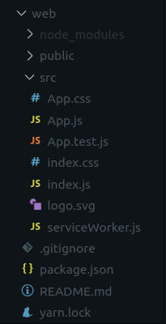
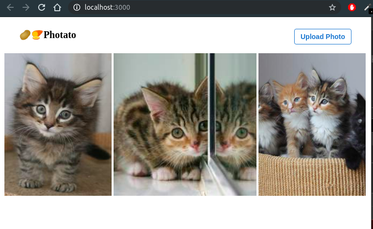
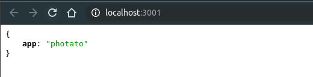
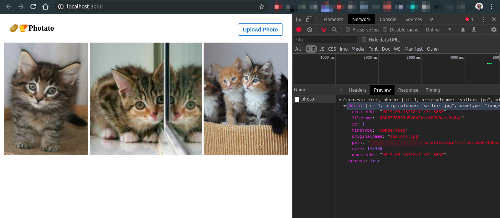
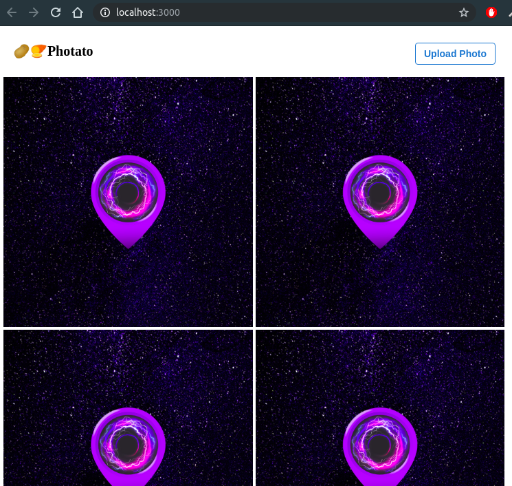
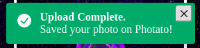
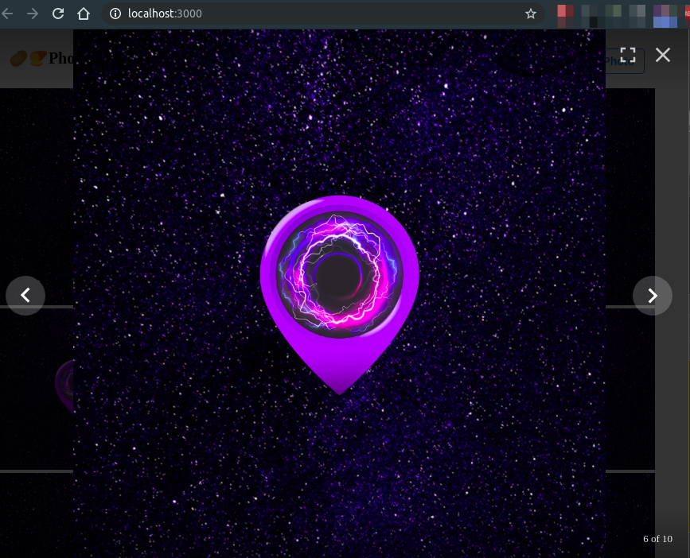

React.js is now one of the most battle-tested and matured frontend frameworks in the world and express.js is it's counterpart among backend/server frameworks. If you're building an app today, you can't pick a better duo than this. In this post, I will walk you through building a complete app using those two frameworks.

Table Of Contents
=================
1. [Is this post for me?](#is-this-post-for-me)
2. [Laying the ground work](laying-the-ground-work)
3. [Photo gallery with chakra UI and React](#photo-gallery-with-chakra-UI-and-React)
5. [Server API to store photo and info in database with express and sequelize](#server-api)
6. [Connect gallery with server api](#connect-gallery-with-server-api)
7. [UX tidbits](#ux-tidbits)
8. [Closing remarks](#closing-remarks)

Before we dive in, for the impatients like me, here's the entire codebase [on github](https://github.com/foysalit/logrocket-photato). Feel free to clone it and take it for a spin.

Is this post for me?
====================
As a self-taught fullstack dev, I always find myself scouring through the web for blog posts/tutorials that build out entire application from scratch demonstrating one or multiple commonly seen features in real-life apps. This kind of posts help devs across a large spectrum of skillset/experience. Beginners learn how to glue together new concepts they have learned recently and turn it into a complete and usable app. Devs with intermediate level of knowledge can learn how to organize, structure and apply best practises when building fullstack apps. So, if you're just getting into the js ecosystem or if you have already built one or two of your own applications using js but sometimes get confused if you're doing it right, this post is **for you**.

Having said that, to read and complete this in one sitting, you will need to have:

- clear understanding of basic JS concepts and some familiarity with es6 syntax
- used react at least once, familiarity of it's common concepts such as states, components, renders etc. 
- familiarity with the concept of REST api
- used relational database 
- used node.js and express.js for web server app
- a working setup of js ecosystem on your machine. i.e: npm, nodejs etc. latest versions installed

If you find yourself not checking off any of the above items, worry not! LogRocket blog has plenty of contents that will help you get started and prepared for this post. 

**Please take note that**: my primary OS is ubuntu so all the commands in this post assumes you have a *Nix system.

Laying the ground work
======================
Before starting any new project, it is easy to get impatient and start writing code right away. However, it is always a good idea to plan out your features and workflow first, at least that's what I always do. So let's make a plan of how our app will work:

Our app will have 2 main parts. One is the client side react app that lets me upload photos through my browser. The uploaded photos are then shown in a gallery view. The other one is a server side api that receives a photo upload and stores it somewhere and lets us query and display all the uploaded photos.

However, before all that programming mumbo-jumbo, let's give our app a catchy name. I'm calling it ***photato*** but feel free to give it a better name yourself and let me know what you come up with :)

Ok, time to code. Let's make a container folders for our app first:

```bash
mkdir photato && cd $_
mkdir web
mkdir api
```

We will start by creating our frontend react app first. React comes with a handy tool that let's your bootstrap a react app real fast: 

```bash
cd web
npx create-react-app web
```

Now you should have a bunch of files and folders in the `web/` folder and the output will tell you that by going into the directory and running `yarn start` you can make your app available at [http://localhost:3000](http://localhost:3000). 



Now, if you have built websites/webapps before, you might be familiar with the struggle of building UIs with raw html and css and know that UI toolkits/libraries like twitter bootstrap, semantic UI, material kit etc. have long been the saviors of fullstack devs who can't produce "dribbble famous" quality of design. In this post, we will look away from the most common and traditional UI libraries mentioned above and use [Chakra UI](https://chakra-ui.com/), built on the utility first css framework [tailwind css](https://tailwindcss.com) and with accessibility in mind.

Following the Chakra UI get started guide, run the following commands in your react app's root directory: 

```bash
yarn add @chakra-ui/core @emotion/core @emotion/styled emotion-theming
```

Chakra UI allows you to customize it's look and feel, through theming, very easily but for this post, we will stick to it's default styling.

The last thing we need before we can start coding is add one more library to get a [pretty looking gallery](https://github.com/neptunian/react-photo-gallery): 

```bash
yarn add react-photo-gallery
```

Our app's code will be encapsulated within the `src/` directory so let's take a look at it. create-react-app gave us a bunch of files and with the help of chakra UI we can basically get rid of all the css stuff. Remove the `App.css`, `index.css` and `logo.svg` file:

```bash
cd src
rm -r App.css index.css logo.svg
```

This gives us a clean base to start building from. Now let's look at our setup for the server api app. Navigate back to the api folder and create a new files by running the following commands:

```bash
cd ../../api
touch package.json
```

Now copy-paste the following code into the `package.json` file:

```json
{
  "name": "api",
  "version": "1.0.0",
  "description": "Server api for photato",
  "main": "dist",
  "author": "Foysal Ahamed",
  "license": "ISC",
  "entry": "src/index.js",
  "scripts": {
    "dev": "NODE_ENV=development nodemon src/index.js --exec babel-node",
    "start": "node dist",
    "build": "./node_modules/.bin/babel src --out-dir dist --copy-files",
    "prestart": "npm run -s build"
  },
  "eslintConfig": {
    "extends": "eslint:recommended",
    "parserOptions": {
      "ecmaVersion": 7,
      "sourceType": "module"
    },
    "env": {
      "node": true
    },
    "rules": {
      "no-console": 0,
      "no-unused-vars": 1
    }
  },
  "dependencies": {
    "cors": "^2.8.4",
    "express": "^4.13.3",
    "mysql2": "^1.6.1",
    "sequelize": "^5.18.4"
  },
  "devDependencies": {
    "@babel/cli": "^7.1.2",
    "@babel/core": "^7.1.2",
    "@babel/node": "^7.0.0",
    "@babel/plugin-proposal-class-properties": "^7.1.0",
    "@babel/preset-env": "^7.1.0",
    "eslint": "^3.1.1",
    "eslint-config-airbnb": "^17.1.0",
    "eslint-plugin-jsx-a11y": "^6.2.1",
    "nodemon": "^1.9.2"
  }
}
```

Notice that we have quite a few ***dev dependencies*** and they are needed to enable writing our app in using latest es6 syntax transpiled through babel. Babel is a magnificent tool and full of wonderful features but to use it, you need to know almost nothing about it. In our case, we just need to create a `.babelrc` file alongside the `package.json` file and put the following config in it:

```json
{
    "presets": [[
        "@babel/preset-env",
        {
            "targets": {
                "node": "current"
            }
        }
    ]],
    "plugins": [
        "@babel/plugin-proposal-class-properties"
    ]
}
```

There's also a few dependencies like [express](https://expressjs.com/) and [sequelize](https://sequelize.org/)] and we will see their usage later. That's all the setup we need for our server app and but before we move on, let's install all the packages by running `npm install` command in the root of the api folder. This command will generate a `node_modules/` folder and a `package.lock.json` file.


Photo gallery with chakra UI and React
======================================
We will start with the `App.js` file. Let's clean up the generated code and fill it with the following code: 

```javascript
import React from 'react';
import { ThemeProvider } from '@chakra-ui/core';

import AppContainer from './app.container';

function App() {
    return (
        <div>
            <ThemeProvider>
                <AppContainer />
            </ThemeProvider>
        </div>
    );
}

export default App;
```

This simplifies our entry component and delegates the actual logic/behavior to another Container named `AppContainer` which is wrapped within `ThemeProvider` from chakra UI. The `ThemeProvider` component ensures that all of it's children can be styled with the chakra UI theme or any custom theme that you may want to pass to it.

Now with that out of the way, we will never have to touch `App.js` again. Let's create the new file `touch src/app.container.js` and fill it with the following code:


```javascript
import React from 'react';
import PhotoGallery from 'react-photo-gallery';

import Header from './header.component';

function AppContainer() {
    const photos = [{
            src: 'http://placekitten.com/200/300',
            width: 3,
            height: 4,
        },
        {
            src: 'http://placekitten.com/200/200',
            width: 1,
            height: 1,
        },
        {
            src: 'http://placekitten.com/300/400',
            width: 3,
            height: 4,
        },
    ];

    return (
        <>
            <Header/>
            <PhotoGallery
                photos={photos}
            />
        </>
    );
}

export default App;
```

This component renders 2 other components, `Header` and `PhotoGallery` where `PhotoGallery` is provided by the npm photo gallery lib. Note that we are passing a photos array containing placeholder images to the `PhotoGallery` component, we will get back to it later in the post and replace the heartwarming kitten photos with our own uploaded photos

The other component `Header` is being imported from a file that doesn't exist yet so let's create it: `touch src/header.component.js` and put the following code in the file:

```javascript
import React from 'react';
import { Flex, Button, Text } from '@chakra-ui/core';

function Header ({
    isUploading = false, 
    onPhotoSelect,
}) {
    return (
        <Flex 
            px="4"
            py="4"
            justify="space-between"
        >
            <Text 
                as="div"
                fontSize="xl" 
                fontWeight="bold" 
            >
                <span 
                    role="img" 
                    aria-labelledby="potato"
                >
                    🥔 
                </span> 
                <span 
                    role="img" 
                    aria-labelledby="potato"
                >
                    🍠 
                </span> 
                Photato
            </Text>

            <Flex align="end">
                <Button 
                    size="sm"
                    variant="outline"
                    variantColor="blue"
                    isLoading={isUploading}
                    loadingText="Uploading..."
                >
                    Upload Photo     
                </Button>
            </Flex>
        </Flex>
    );
};

export default Header;

```

If you followed all the above steps, the app in your browser should render something like this:  


Now, let's break down what we've done so far. 

The header component wraps all it's children in a Chakra UI `Flex` component that renders an html `div` element with css style `display: flex`. Being a utility based css framework, Chakra UI allows you to pass various props to it's components to style it to your liking and you will see this used throughout our app. In our wrapper `Flex` component `px` and `py` props give it a nice horizontal and vertical padding (respectively) and the `justify="space-between"` prop ensures that the elements inside it are rendered with equal spacing between them. If you're not much familiar with css flexbox, I highly encourage you to learn more about this amazing layout tool.

Inside the `Flex` container, we have a `Text` on the left of the screen and a `Button` for uploading new photos on the right of the screen. Let's take a closer look at the `Button` here. we use `size="sm"` to give it a smaller size but you can play around with `lg`, `xs` etc. values to change the size. The `variant="outline"` prop makes it a bordered button instead of filling it with color and speaking of color, `variantColor="blue"` makes the border and the text blue. There are several other colors available out of the box from Chakra UI and I would highly recommend [reading up on it](https://chakra-ui.com/color-mode).

So far we have been focused on the looks. Let's talk about the functionality. This component is a great example of one of the core principle of writing clean and easily maintainable frontend code. It's a ***dumb component*** that only renders the markup and there is no logic being handled. To make it functional, we pass props to it from the parent. It expects two props: 

- `isUploading` which is a boolean and defaults to `false`. This prop determines the state of the ***Upload Button***. When it is true, the button will go into a `loading` state to give the user a feedback that uploading is happening in the background.
- `onPhotoSelect` which is a function that will be triggered when the user selects a new photo to upload. we will circle back to it later.

This way of writing components really helps you plan out the functionality and architecture small chunk at a time. Without implementing the actual logic, we have already planned out how the button will work based on the requirements of our app.

We have a solid and functional base for our frontend app now so let's pause here for a moment and start setting up our backend.

Server API
==========
The entry point for our server api will be `src/index.js` file so let's create that:

```bash
mkdir src
touch index.js
```

Then put the following code in that file:

```javascript
import http from 'http';
import cors from 'cors';
import express from 'express';
import { Sequelize } from 'sequelize';

const config = {
    port: 3001,
    database: {
        username: "root",
        password: "admin",
        host: "localhost",
        port: "3306",
        dialect: "mysql",
        database: "photato",
    }
};

let app = express();
app.server = http.createServer(app);

// 3rd party middlewares
app.use(cors({}));

// connect to db
const database = new Sequelize(config.database);

database.sync().then(() => {
    app.get('/', (req, res) => {
        res.json({app: 'photato'});
    });

    app.server.listen(config.port, () => {
        console.log(`Started on port ${app.server.address().port}`);
    });
});

export default app;
```

This is a barebone setup and let's break it down block by block.

```javascript
import http from 'http';
import cors from 'cors';
import express from 'express';
import { Sequelize } from 'sequelize';
```
Imports the necessary modules from node's built in http package and other 3rd party packages installed through npm.


```javascript
const config = {
    port: 3001,
    database: {
        username: "root",
        password: "admin",
        host: "localhost",
        port: "3306",
        dialect: "mysql",
        database: "photato",
    }
};
```
Defines configurations for database and server port where the app will be available. You will need to change the database __password__ and __username__ based on your mysql database setup. Also, make sure you create a new database schema named `photato` in your db. 

**Please note that:** In production ready applications you would pass the configs from env var instead of hardcoding them.

```javascript
let app = express();
app.server = http.createServer(app);

// 3rd party middlewares
app.use(cors({}));

```
Initializes the express app and creates a server instance using node's `http.createServer` method. 
Express allows plugging in various functionalities through middlewares. One such middleware we are going to use enables CORS requests for our api. Right now, we are allowing CORS requests from any origin but you can add more fine-grain config to allow requests only from your frontend app's domain name for security purposes.

```javascript
// connect to db
const database = new Sequelize(config.database);

database.sync().then(() => {
    app.get('/', (req, res) => {
        res.json({app: 'photato'});
    });

    app.server.listen(config.port, () => {
        console.log(`Started on port ${app.server.address().port}`);
    });
});
```
Initializes a sequelize instance that connects to our mysql database based on our config. Once the connection is established, it adds a handler for the `/` endpoint of our api that returns a json formatted response. Then the is opened up through the server port specified in the config.

We can now boot up our app and see what we have achieved so far. Run `npm run dev` in the `api/` folder and then go to [http://localhost:3001](http://localhost:3001) and you should see something like this:



Handling file uploads has a lot of edge cases and security concerns so it's not a very good idea to build it from scratch. We will use an npm package called [multer](https://github.com/expressjs/multer) that makes it super easy. Install the package by running `npm i --save multer` and then make the following changes in the `src/index.js` file.

```javascript
import http from 'http';
import cors from 'cors';
import multer from 'multer';
import { resolve } from 'path';

//previously written code here

const config = {
    port: 3001,
    uploadDir: `${resolve(__dirname, '..')}/uploads/`,
    database: {
        username: "root",
        password: "admin",
        host: "localhost",
        port: "3306",
        dialect: "mysql",
        database: "photato",
    }
};

//previously written code here

// connect to db
const database = new Sequelize(config.database);

// setup multer
const uploadMiddleware = multer({ 
    dest: config.uploadDir,
    fileFilter: function (req, file, cb) {
        if (!file.originalname.match(/\.(jpg|jpeg|png|gif)$/)) {
            return cb(new Error('Only image files are allowed!'));
        }
        cb(null, true);
    }, 
}).single('photo');

//previously written code here

    app.get('/', (req, res) => {
        res.json({app: 'photato'});
    });

    app.post('/photo', uploadMiddleware, async (req, res) => {
        try {
            const photo = await Photo.create(req.file);
            res.json({success: true, photo});
        } catch (err) {
            res.status(422).json({success: false, message: err.message});
        }
    });

//previously written code here
```

Overview of the additions:
- Imports multer package
- Adds the destination directory where the uploaded files will be stored. Right now, it's set to be `api/upload/` which doesn't exist so let's create the folder as well: `mkdir upload` 
- Initializes the multer middleware that accepts a single file with the key `photo` and saves the file in the specified folder
- Only allows image files to be uploaded through multer
- Adds a new POST request endpoint that uses the upload middleware. Once the file is handled by middleware, it attaches the file info such as destination path, size, mimetype etc. info to the express req object that is passed to the next handler. In this case, the next handler ***tries*** to save the file details in the database (we will discuss this soon) and on success, it returns a json response including the file details and on failure it returns a json response with the error message.

This line `const photo = await Photo.create(req.file);`, however, needs a bit more explanation. `ModelName.create(modelData)` is how you create a new row in a database table through sequelize and in the above code, we expect a sequelize model named `Photo` to exist, which we haven't created yet. Let's fix that by running `touch src/photo.model.js` and putting the following code in that file:

```javascript
import { Model, DataTypes } from 'sequelize';

const PhotoSchema = {
    originalname: {
        type: DataTypes.STRING,
        allowNull: false,
    },
    mimetype: {
        type: DataTypes.STRING,
        allowNull: false,
    },
    size: {
        type: DataTypes.INTEGER,
        allowNull: false,
    },
    filename: {
        type: DataTypes.STRING,
        allowNull: false,
    },
    path: {
        type: DataTypes.STRING,
        allowNull: false,
    },
};

class PhotoModel extends Model {
    static init (sequelize) {
        return super.init(PhotoSchema, { sequelize });
    }
};

export default PhotoModel;
```

That's a lot of code but the gist of it is that we are creating a sequelize model class with a schema definition where the fields (table columns) are all strings (translates to varchar in mysql) except for the size field which is an integer. The schema looks like this because after handling uploaded files, multer provides exactly those data and attaches it to `req.file`. 

Going back to how this model can be used in our route handler, we need to connect the model with mysql through sequelize. In `src/index.js` file add the following lines:

```javascript
// previously written code
import { Sequelize } from 'sequelize';
import PhotoModel from './photo.model';

// previously written code

// connect to db
const database = new Sequelize(config.database);

// initialize models
const Photo = PhotoModel.init(database);

// previously written code

```

So now that we have pieced together the missing case of the `Photo`, let's add one more endpoint to our api and see one more usage of the model:

```javascript
// previously written code

    app.get('/', (req, res) => {
        res.json({app: 'photato'});
    });

    app.get('/photo', async (req, res) => {
        const photos = await Photo.findAndCountAll();
        res.json({success: true, photos});
    });

// previously written code
```

This adds a GET request handler at the `/photo` path and returns a json response containing all the previously uploaded photos. Notice that `Photo.findAndCountAll()` returns an object that looks like this: 

```json
{
    count: <number of entries in the model/table>,
    rows: [
        {<object containing column data from the table>},
        {<object containing column data from the table>},
        ....
    ]
}
```

With all the above changes, your `src/index.js` file should look like this:

```javascript
import http from 'http';
import cors from 'cors';
import multer from 'multer';
import express from 'express';
import { resolve } from 'path';
import { Sequelize } from 'sequelize';

import PhotoModel from './photo.model';

const config = {
    port: 3001,
    uploadDir: `${resolve(__dirname, '..')}/uploads/`,
    database: {
        username: "root",
        password: "admin",
        host: "localhost",
        port: "3306",
        dialect: "mysql",
        database: "photato",
    }
};

let app = express();
app.server = http.createServer(app);

// 3rd party middlewares
app.use(cors({}));

// connect to db
const database = new Sequelize(config.database);

// initialize models
const Photo = PhotoModel.init(database);

// setup multer
const uploadMiddleware = multer({ 
    dest: config.uploadDir,
    fileFilter: function (req, file, cb) {
        if (!file.originalname.match(/\.(jpg|jpeg|png|gif)$/)) {
            return cb(new Error('Only image files are allowed!'));
        }
        cb(null, true);
    },
}).single('photo');

database.sync().then(() => {
    app.get('/', (req, res) => {
        res.json({app: 'photato'});
    });

    app.get('/photo', async (req, res) => {
        const photos = await Photo.findAndCountAll();
        res.json({success: true, photos});
    });

    app.post('/photo', uploadMiddleware, async (req, res) => {
        try {
            const photo = await Photo.create(req.file);
            res.json({success: true, photo});
        } catch (err) {
            res.status(400).json({success: false, message: err.message});
        }
    });

    app.server.listen(process.env.PORT || config.port, () => {
        console.log(`Started on port ${app.server.address().port}`);
    });
});

export default app;
```

You've come this far, congrats! Go grab a coffee or something refreshing and get ready to cross the finish line in style.


Connect gallery with server api
===============================
At this point, we have 2 apps. One is a browser based react app that runs on [http://localhost:3000](http://localhost:3000) and the other is a server side node.js app running on [http://localhost:3001](http://localhost:3001) but so far they have been strangers to each other living their own lives. So naturally, the next step is to marry the two and hope that they live happily ever after! 

We are going to use the browser's [fetch API](https://developer.mozilla.org/en-US/docs/Web/API/Fetch_API) to talk to our server app from the react app. To keep our server communication encapsulated, we will create a new file: 

```
cd ../web/
touch src/api.js
```

Then let's add the following functions in that file:

```javascript
const API_URL = 'http://localhost:3001';

export async function getPhotos () {
    const response = await fetch(`${API_URL}/photo`);
    return response.json();
};

export async function uploadPhoto (file) {
    if (!file)
        return null; 

    const photoFormData = new FormData();

    photoFormData.append("photo", file);
    
    const response = await fetch(`${API_URL}/photo`, {
        method: 'POST',
        body: photoFormData,
    });

    return response.json();
};
```

Let's break it down:
- We have a variable `API_URL` that points to the url where our server app is available. 
- `getPhotos` makes a GET request to the `/photo` endpoint of our server and parses the response as json before returning it.
- `uploadPhoto` receives a `file` parameter and builds a `FormData` object that can be used to POST the file to the `/photo` endpoint of our server. After sending the request, it parses the response as json and returns it.

Let's use these nifty little functions, shall we? Open up the `src/app.container.js` file and add the following new lines in it:

```javascript
import React, { useState } from 'react';
// previously written code...

import { uploadPhoto } from './api';

function AppContainer() {
    const [isUploading, setIsUploading] = useState(false);
    
    async function handlePhotoSelect (file) {
        setIsUploading(true);
        await uploadPhoto(file);
        setIsUploading(false);
    };

    return (
            // previously written code...
            <Header
                isUploading={isUploading}
                onPhotoSelect={handlePhotoSelect}
            />
            // previously written code...
    );
}
```

With the above changes, we have added state hooks in our `App` component. If you're not familiar with hooks and states, I encourage you to [read up on it](https://blog.logrocket.com/state-management-using-only-react-hooks/) but in short, state lets you re-render your UI whenever your state value changes. 

Whenever our function `handlePhotoSelect` is executed with a file argument, it will first change `isUploading`'s value to `true`. Then it will pass the file data to our `uploadPhoto` function and when that finishes, it will switch `isUploading`'s value to `false`;

```javascript
<Header
    isUploading={isUploading}
    onPhotoSelect={handlePhotoSelect}
/>
```

Then, we pass our `isUploading` state as a prop to our header component and if you recall, when `isUploading` changes to `true` our ***Upload Photo*** button will transition into a loading state. The second prop `onPhotoSelect` gets the function `handlePhotoSelect`. Remember when wrote our `Header` component we defined the `onPhotoSelect` prop but never used it? Well, let's settle that by making the following changes in the `src/header.component.js` file:

```javascript
// previously written code...
function Header ({
    isUploading = false, 
    onPhotoSelect,
}) {
    let hiddenInput = null;

    // previously written code...

    return (
        // previously written code...
                <Button 
                    // previously written code...
                    onClick={() => hiddenInput.click()}
                >
                    Upload Photo     
                </Button>

                <input
                    hidden
                    type='file'
                    ref={el => hiddenInput = el}
                    onChange={(e) => onPhotoSelect(e.target.files[0])}
                />
        // previously written code...
    );
};
```

The above changes add a hidden file input element and stores it's reference in the `hiddenInput` variable. Whenever the `Button` is clicked, we trigger a click on the file input element using the reference variable. From there on, browser's built in behavior kicks in and asks the user to select a file. After the user makes a selection, `onChange` event is fired and when that happens, we call the `onPhotoSelect` prop function and pass the selected file as it's argument. 

This completes one communication channel between our frontend and backend apps. Now, you should be able to follow the below steps and get a similar result along the way:

1. Go to [http://localhost:3000](http://localhost:3000) 
2. Open the developer's tool and go to the Network tab
3. Click the ***Upload Photo*** button and select an image file from your local folders.
4. See a new POST request being sent to http://localhost:3001/photos and a json response coming back.

Here's how mine looks:



To verify that the upload worked, go into the `api/uploads` directory and you should see a file there. Try uploading more photos and see if they keep showing up in that folder.

This is great, right? We are actually uploading our photos through our react app and saving it with our node.js server app. Sadly, the last step to tie it all together is to replace those kitty cats with our uploaded photos. To do that we need to be able to request the server for an uploaded photo and get the photo file back. Let's do that by adding one more endpoint in `api/src/index.js` file:

```javascript
// previously written code...
    app.get('/', (req, res) => {
        res.json({app: 'photato'});
    });

    app.get("/photo/:filename", (req, res) => {
        res.sendFile(join(config.uploadDir, `/${req.params.filename}`));
    });
// previously written code...
```

The new endpoint allows us to pass any string in place of `:filename` through the url and the server looks for a file with that name in our `uploadDir` and sends the file in the response. So, if we have a file named `image1`, we can access that file by going to `http://localhost:3001/photo/image1` and going to `http://localhost:3001/photo/image2` will give us the file named `image2`. 

That was easy, right? Now back to the frontend. Remember how our initial boilerplate `photos` variable looked like? The data that we get from the server is nothing like that, right? We will fix that first. Go back to `web/src/api.js` file and make the following changes: 

```javascript
export async function getPhotos () {
    const response = await fetch(`${API_URL}/photo`);
    const photoData = await response.json();

    if (!photoData.success || photoData.photos.count < 1)
        return [];

    return photoData.photos.rows.map(photo => ({
        src: `${API_URL}/photo/${photo.filename}`,
        width: 1, 
        height: 1,
    }));
};
```

The extra lines are just transforming our server sent data into the format that can be passed to our `PhotoGallery` component. it builds the `src` url from the `API_URL` and the filename property of each photo.

Back in the `app.container.js` file, we add the following changes:

```javascript
import React, { useState, useEffect } from 'react';
// previously written code...

import { uploadPhoto, getPhotos } from './api';

function AppContainer() {
    const [isUploading, setIsUploading] = useState(false);
    const [photos, setPhotos] = useState([]);

    useEffect(() => {
        if (!isUploading)
            getPhotos().then(setPhotos);
    }, [isUploading]);
    
    // previously written code...
}
```

That's it! That's all you need to show the uploaded photos in the image gallery. We replaced our static `photos` variable with a state variable and initially set it to empty array. 
Most noteable thing in the above change is the `useEffect` function. Everytime `isUploading` state is changed, it as a side effect, react will run the first argument function in `useEffect` call. Within that function we check if `isUploading` is `false`, meaning that a new upload is either complete or the component is loaded for the first time and only for those cases we execute `getPhotos` and the results of that function are stored in the `photos` state variable. This ensures that besides loading all the previous photos on first load, the gallery is also refreshed with the newly uploaded photo as soon as the upload is complete without needing to refresh the window.

This is fun so I uploaded 4 consecutive photos and this is how my photato looks now:



UX tidbits
==========
While we do have a functioning app that meets all the requirements we set out to build, it could use some UX improvements. For instance, upload success/error does not trigger any feedback for the user. We will implement that by using a nifty little `toast` component from Chakra UI. Let's go back to the `web/src/app.container.js`:

```javascript
// previously written code...
import PhotoGallery from 'react-photo-gallery';
import { useToast } from '@chakra-ui/core';
// previously written code...

    const [photos, setPhotos] = useState([]);
    const toast = useToast();

    async function handlePhotoSelect (file) {
        setIsUploading(true);

        try {
            const result = await uploadPhoto(file);
            if (!result.success)
                throw new Error("Error Uploading photo");
                
            toast({
                duration: 5000,
                status: "success",
                isClosable: true,
                title: "Upload Complete.",
                description: "Saved your photo on Photato!",
            });
        } catch (err) {
            toast({
                duration: 9000,
                status: "error",
                isClosable: true,
                title: "Upload Error.",
                description: "Something went wrong when uploading your photo!",
            });
        }

        setIsUploading(false);
    };
// previously written code...
```

With the above changes, you should get a green little toast notification at the bottom of your screen everytime you upload a new photo. Also, notice that in case of error, we are also calling the toast with `status:"error"` which will show a red toast instead of green. 

This is how my success toast look like:


The gallery is made up of thumbnails. Shouldn't we be able to see the full image as well? That would improve the UX a lot, right? So let's built a full screen version of the gallery with [react-images](https://github.com/jossmac/react-images) package.

Start by running `yarn add react-images` within the `web/` directory. Then pop open the `src/app.container.js` file and add the following bits:

```javascript
import React, { useState, useEffect, useCallback } from 'react';
import Carousel, { Modal, ModalGateway } from "react-images";
// previously written code...

function AppContainer() {
    const [currentImage, setCurrentImage] = useState(0);
    const [viewerIsOpen, setViewerIsOpen] = useState(false);

    const openLightbox = useCallback((event, { photo, index }) => {
        setCurrentImage(index);
        setViewerIsOpen(true);
    }, []);

    const closeLightbox = () => {
        setCurrentImage(0);
        setViewerIsOpen(false);
    };

    // previously written code...
    return (
        // previously written code...
            <PhotoGallery
                photos={photos}
                onClick={openLightbox}
            />
            <ModalGateway>
                {viewerIsOpen && (
                    <Modal onClose={closeLightbox}>
                        <Carousel
                            currentIndex={currentImage}
                            views={photos.map(x => ({
                                ...x,
                                srcset: x.srcSet,
                                caption: x.title
                            }))}
                        />
                    </Modal>
                )}
            </ModalGateway>
        // previously written code...
    );
}
```

Here's what the changes are doing:
- Imports the necessary components from `react-images` to show a fullscreen gallery.
- Initiates two state variables `currentImage` and `viewerIsOpen`. We will see how they are used soon.
- Creates a memoized callback function `openLightbox` that gets triggered when the user clicks on any of the photos from the photo gallery. When executed, the function sets `viewerIsOpen` to true and sets the index number of the photo that was clicked.
- Another function `closeLightbox` is created that essentially closes the fullscreen gallery.
- In the render method, if `viewerIsOpen` is `true` we render the modal lightbox containing the `Carousel` component from react-images lib. 
- The `Modal` component receives the prop `onClose={closeLightbox}` so that the user can close the full screen gallery.
- We pass the `currentImage` index number to it so it knows which photo will be shown first and in addition we transform all the photos from the gallery and pass it to the carousel so that the user can swipe through all the photos in fullscreen mode.

The end result:



Closing remarks
===============
- What we have built throughout this journey is a complete and functional app but there's a lot of room for improvement. Architecture, file-folder structure, testability all of these things should be considered for refactoring both our client and server side apps. I would like you to take it as a homework and add unit and/or integration testing to the codebase. 
- Chakra UI is a promising new tool and has numerous of components that will be hard to cover in one post so I highly encourage you to go through their docs to learn more.
- These days, saving uploaded content on the same disk where your app is running is somewhat frowned upon. Luckily, multer has a lot of handy 3rd party plugins that would allow you to upload files directly to external storage such as s3. If you every deploy your server app on hosting services like zeit now or netlify, they will come in handy.